# Calculated data documents construction module

This module is intended to simplify the construction of calculated data documents.

This documentation starts with a general explanation of the module and then an example is used to explain each of the components in detail.

## File structure

The module is composed of 5 parts.

```
  ├── README.md                 # this file
1 ├── extractor.py              # generic logic to transform parser data into elements
2 ├── config.py                 # classes to specify configuration and construction logic
3 ├── view.py                   # generic logic to split elements into a tree like structure
4 ├── docs/                     # documentation directory
     ├── *.png                  # diagrams
     └── example/               # example code
        ├── parser_code/        # directory for example parser code
           ├── measurement.py   # example of parser measurement
           └── parser.py        # example of calculated data construction
        ├── parser_calcdoc/     # directory for example parser calcdoc code
          ├── extractor.py      # extractor implementation for example parser
          └── views.py          # views implementation for example parser
5 ├── <parser_dir N>/           # directory for a specific parser calcdoc code
    ├── extractor.py            # extractor implementation for specific parser
    └── views.py                # view implementation for specific parser
```

## Example

As shown before an example is located in the **doc** directory.

It is composed of two parts, a **parser** directory containing a dummy implementation of an allotropy parser that uses the module and the specific implementations of **extractor** and the **views** related to the parser.

###  Input data

The dummy parser is meant to parser an input file like follows

| sid | tid | m | sum | mean |
| --- | --- |-- | --- | ---- |
| a | x | 1  | 3  | 5  |
| a | x | 2  | 3  | 5  |
| a | x | 3  | 7  | 5  |
| a | x | 4  | 7  | 5  |
| a | y | 5  | 11 | 13 |
| a | y | 6  | 11 | 13 |
| a | y | 7  | 15 | 13 |
| a | y | 8  | 15 | 13 |
| b | x | 9  | 19 | 21 |
| b | x | 10 | 19 | 21 |
| b | x | 11 | 23 | 21 |
| b | x | 12 | 23 | 21 |
| b | y | 13 | 27 | 29 |
| b | y | 14 | 27 | 29 |
| b | y | 15 | 31 | 29 |
| b | y | 16 | 31 | 29 |


In this file there are 16 measurements, each of them grouped by a combination of **sid** and **tid**, resulting in 4 groups of 4 measurements. In this file the column **m** represent a variable measured, **sum** is the sum of two elements and **mean** is the mean value of both sums present in a group. This means that this file can also be represented as the following graph

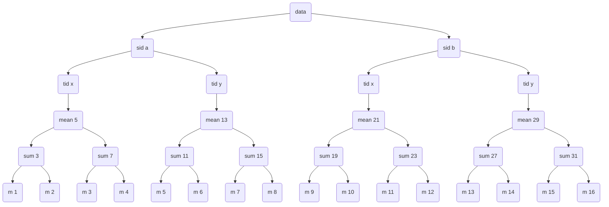

The objective of this example is to show how this module can be used to create the calculated data documents for **Sum** and **Mean**.

###  Measurement representation in parser

To parse this input file the dummy parser implements a measurement dataclass in the **measurement.py** file.

```
@dataclass
class Measurement:
    uuid: str
    sid: str
    tid: str
    m: float
    sum: float
    mean: float
```

Then a list of measurements is created as follows

```
[
    Measurement(uuid1, "a", "x", 1.0, 3.0, 5.0),
    Measurement(uuid2, "a", "x", 2.0, 3.0, 5.0),
    Measurement(uuid3, "a", "x", 3.0, 7.0, 5.0),
    Measurement(uuid4, "a", "x", 4.0, 7.0, 5.0),
    Measurement(uuid5, "a", "y", 5.0, 11.0, 13.0),
    Measurement(uuid6, "a", "y", 6.0, 11.0, 13.0),
    Measurement(uuid7, "a", "y", 7.0, 15.0, 13.0),
    Measurement(uuid8, "a", "y", 8.0, 15.0, 13.0),
    Measurement(uuid9, "b", "x", 9.0, 19.0, 21.0),
    Measurement(uuid10, "b", "x", 10.0, 19.0, 21.0),
    Measurement(uuid11, "b", "x", 11.0, 23.0, 21.0),
    Measurement(uuid12, "b", "x", 12.0, 23.0, 21.0),
    Measurement(uuid13, "b", "y", 13.0, 27.0, 29.0),
    Measurement(uuid14, "b", "y", 14.0, 27.0, 29.0),
    Measurement(uuid15, "b", "y", 15.0, 31.0, 29.0),
    Measurement(uuid16, "b", "y", 16.0, 31.0, 29.0),
]
```

These measurements are the input of the calcdocs module.

## Module structure

The following diagram explains a high level view of the module.


1. The objects containing the information of a specific parser is passed to the extractor.
<br> *This objects usually are dataclasses. But they can be any type of python object
2. The specific parser instance of the extractor takes the objects and transform them into generic elements.
<br> *Elements are just a dictionary like representation of the information contained in the original objects
3. The configuration is used to generate calculated data document objects by using the inner views and construction logic.
4. The specific parser mapper takes the calculated data documents and generates the ASM json output.

## Extractor


The idea of the extractor is to transform objects of type T into elements.
An element is a dataclass with only one attribute that represents the information of the object in the form of a dictionary and the methods to access that information.

The extractor needs to be implemented for each of the parsers to match the structure of the objects it handles.

In the example parser the extractor is implemented as follows

```
class ExampleExtractor(Extractor[Measurement]):
    @classmethod
    def to_element(cls, measurement: Measurement) -> Element:
        return Element(
            uuid=measurement.uuid,
            data={
                "sid": measurement.sid,
                "tid": measurement.tid,
                "m": measurement.m,
                "sum": measurement.sum,
                "mean": measurement.mean,
            },
        )
```

This means that the measurement list from before is transformed by this extractor into a list of generic elements that can be processed by the construction logic.

```
Element(uuid='uuid1', data={'sid': 'a', 'tid': 'x', 'm': 1.0, 'sum': 3.0, 'mean': 5.0})
Element(uuid='uuid2', data={'sid': 'a', 'tid': 'x', 'm': 2.0, 'sum': 3.0, 'mean': 5.0})
Element(uuid='uuid3', data={'sid': 'a', 'tid': 'x', 'm': 3.0, 'sum': 7.0, 'mean': 5.0})
Element(uuid='uuid4', data={'sid': 'a', 'tid': 'x', 'm': 4.0, 'sum': 7.0, 'mean': 5.0})
Element(uuid='uuid5', data={'sid': 'a', 'tid': 'y', 'm': 5.0, 'sum': 11.0, 'mean': 13.0})
Element(uuid='uuid6', data={'sid': 'a', 'tid': 'y', 'm': 6.0, 'sum': 11.0, 'mean': 13.0})
Element(uuid='uuid7', data={'sid': 'a', 'tid': 'y', 'm': 7.0, 'sum': 15.0, 'mean': 13.0})
Element(uuid='uuid8', data={'sid': 'a', 'tid': 'y', 'm': 8.0, 'sum': 15.0, 'mean': 13.0})
Element(uuid='uuid9', data={'sid': 'b', 'tid': 'x', 'm': 9.0, 'sum': 19.0, 'mean': 21.0})
Element(uuid='uuid10', data={'sid': 'b', 'tid': 'x', 'm': 10.0, 'sum': 19.0, 'mean': 21.0})
Element(uuid='uuid11', data={'sid': 'b', 'tid': 'x', 'm': 11.0, 'sum': 23.0, 'mean': 21.0})
Element(uuid='uuid12', data={'sid': 'b', 'tid': 'x', 'm': 12.0, 'sum': 23.0, 'mean': 21.0})
Element(uuid='uuid13', data={'sid': 'b', 'tid': 'y', 'm': 13.0, 'sum': 27.0, 'mean': 29.0})
Element(uuid='uuid14', data={'sid': 'b', 'tid': 'y', 'm': 14.0, 'sum': 27.0, 'mean': 29.0})
Element(uuid='uuid15', data={'sid': 'b', 'tid': 'y', 'm': 15.0, 'sum': 31.0, 'mean': 29.0})
Element(uuid='uuid16', data={'sid': 'b', 'tid': 'y', 'm': 16.0, 'sum': 31.0, 'mean': 29.0})
```

## Views


The views are a way to split the elements into a tree like structure based on their attributes. This class represents the element divisions with an object called **ViewData** that contains the information of a single node in the structure and the connections to the next one.

### View examples

At this point in the parser example there are 16 elements. These objects can be represented as follows

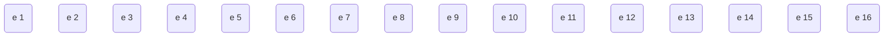

Now, a **View** can be created to split these elements based on any of their attributes.
Since the objective is to create calculated data documents for **Sum** and **Mean** , some **View** implementations are illustrated to show how the elements can be divided based on these two attributes.

### Sum View

```
class SumView(View):
    def __init__(self) -> None:
        super().__init__(name="sum")

    def sort_elements(self, elements: list[Element]) -> dict[str, list[Element]]:
        items = defaultdict(list)
        for element in elements:
            if summation := element.get_float_or_none("sum"):
                items[str(summation)].append(element)
        return dict(items)
```

This **View** would split the original elements into the following structure

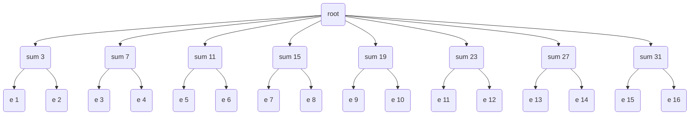

### Mean View

```
class MeanView(View):
    def __init__(self) -> None:
        super().__init__(name="mean")

    def sort_elements(self, elements: list[Element]) -> dict[str, list[Element]]:
        items = defaultdict(list)
        for element in elements:
            if mean := element.get_float_or_none("mean"):
                items[str(mean)].append(element)
        return dict(items)
```

This **View** would split the original elements into the following structure

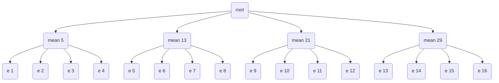

### Nested View

Now, a **View** can be nested to create a multi level representation tree. For example, the **Mean** view can be used as the first level and the **Sum** view as second.

```
MeanView(sub_view=SumView())
```

This new **View** would split the original elements into the following structure

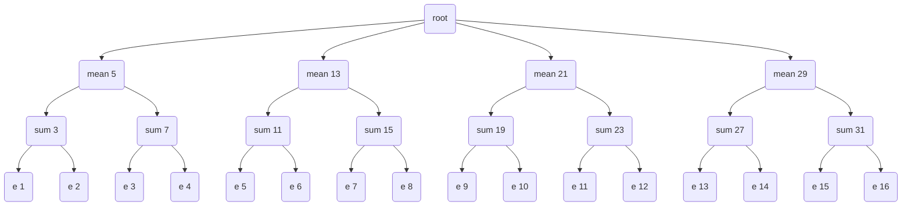

### ViewData

Each non leaf node in the previous structure is a **ViewData** object. The way this class stores the information is by using a dictionary where the keys are all the attribute values found in the examples associated with it, the values of the dictionary are the childs shown in the structure (they can be another **ViewData** in the case of a nested **View** structure or a list of **Element** in the case of a leaf node).

The way that a **ViewData** is accessed is by using a **Keys** object. This object is the representation of the attribute values along the structure that are going to be accessed. For example

```
Keys(
    (Key(name="mean", value=5), Key(name="sum", value=3))
)
```

 If this **Keys** object is used in the result of the nested **View** example the resulting value is a list containing elements 1 and 2.

Other example is

```
Keys(
    (Key(name="mean", value=5),)
)
```
In this case, if this **Keys** object is used in the result of the nested **View** example the resulting value is a **ViewData** containing the following information

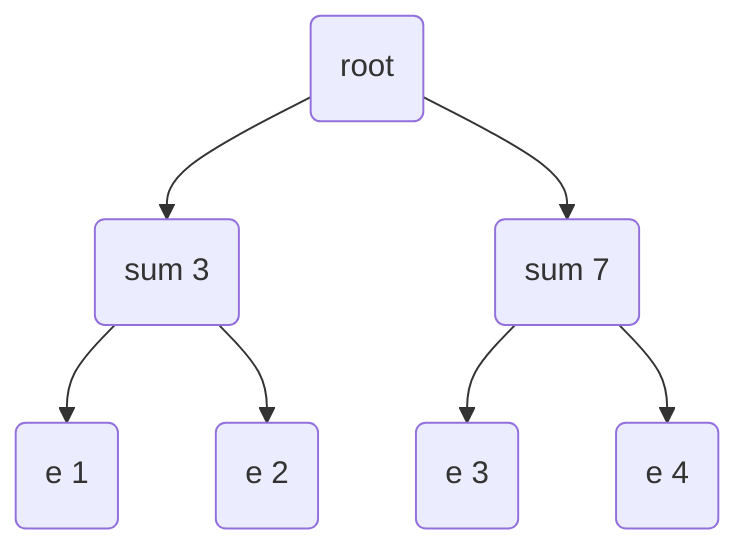

## Real View example

In this section a real example from quantstudio design and analysis adapter is shown.
The file used in this example is **appbio_quantstudio_designandanalysis_QS7_Standard_Curve_example06.xlsx**

1. Example of view with sample id and target dna as levels.


In this example the input of the view are 96 elements. Those elements are first divided by all values of sample id found in the 96 samples, in this case **5K, D1, D2, D3, D4, 1250, 2500, 5000, 10000, 20000, 10K**. Then each of those splits is further divided using the target dna attribute (In this case each group only contains the **RNase P** value) resulting in a single sub group. Finally, at the end of the three there are the elements represented by their **UUIDs**. As can be seen in the diagram each leaf node is composed of different amounts of elements (some contains just 1 element like **D1**, others 4 elements like **2500** and the rest 36 elements like **5K**).

2.  Example of view with sample id, target dna and uuid as levels.


In this example the input of the view are 96 elements. Those elements are first splitted by all values of sample id found in the 96 samples, in this case **5K, D1, D2, D3, D4, 1250, 2500, 5000, 10000, 20000, 10K**. Then each of those splits is further divided using the target dna attribute (In this case each group only contains the **RNase P** value) resulting in a single sub group at this level. Finally, at the end of the three there is the split generated by the **UUID**, which splits the elements by an unique attribute resulting in leafs containing only one element. As can be seen in the diagram the last level of the three is composed of different amounts of nodes, each of them composed by only one element (some finish with just 1 node like **D1**, others with 4 nodes like **2500** and the rest with 36 nodes like **5K**).

3. Example of view with only target dna as level but containing a filter condition.


In this example the input of the view are 96 elements. These elements are first filtered by a condition imposed on the target dna attribute, which results in only 20 elements as part of the division produced by this view. The only value of target dna that is present for those elements is **RNase P** resulting in a single group at this level.

## Module output


The output of the module is composed of two classes, **CalculatedDocument** representing an operation performed over a list of data sources and **DataSource** which represents the elements used in the calculation.

The **CalculatedDocument** dataclass contains an **iter_struct** method used to transform the tree structure into a list. For example, if the output structure of the module looks like this

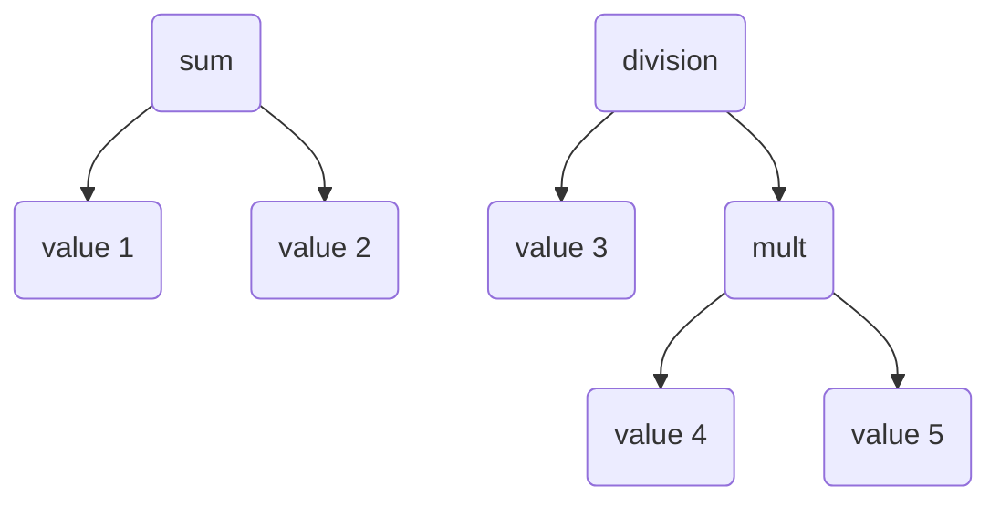

The output of the **iter_struct** would be something like

```
[
    CalculatedDocument(
         name='sum',
         value=3.0,
         data_sources=[
             DataSource(feature='measurement', reference=Element(uuid='uuid1'), value=1.0),
             DataSource(feature='measurement', reference=Element(uuid='uuid2'), value=2.0),
         ],
    ),
     CalculatedDocument(
         name='mult',
         value=20.0,
         data_sources=[
             DataSource(feature='measurement', reference=Element(uuid='uuid4'), value=4.0),
             DataSource(feature='measurement', reference=Element(uuid='uuid5'), value=5.0),
         ],
    ),
    CalculatedDocument(
         name='division',
         value=0.15,
         data_sources=[
             DataSource(feature='measurement', reference=Element(uuid='uuid3'), value=3.0),
             DataSource(feature='calc doc', reference=CalculatedDocument(name='mult'), value=20.0),
         ],
    ),
]
```

Now, there is a possibility that a single node is referenced more than once, for example, the same data is used to calculate a sum and a subtraction. Like this

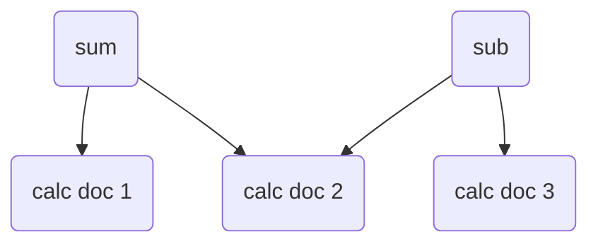

This reuse of **calc doc 2** would result in a duplication in the final list because it will be added when **iter_struct** is invoked in **sum** and again in  **sub**. To avoid this, a boolean attribute called **iterated** is also included in the definition of **CalculatedDocument**, this attribute is set to **False** at creation time and is set to **True** when the object is added to the final list in order to indicate that it should not be added again.

 ### Quantstudio design and analysis real output


This diagram is a partial representation of the actual output produced by the module when executed with the file **appbio_quantstudio_designandanalysis_QS7_Standard_Curve_example06.xlsx**.

In the diagram a single quantity mean calculated data is displayed (representing the combination of sample id **5k** and target dna **RNase P**. This node contains 36 quantity nodes (representing the combination from **5K, RNase P, UUID 0** to **5K, RNase P, UUID 35**. In this visualization only the childs of the first quantity node are shown, in this case a single measurement **cycle threshold result** corresponding to the element with **UUID 0** and two other calculated data **y-intercept** and **slope** each containing 20 measurements **cycle threshold result** corresponding to elements from **UUID 40** to **UUID 59**.


## Configuration


This is the core of the **Calcdocs** module.

It consists of three parts, one container dataclass and two other dataclasses that represent the configuration to create a calculated data document and another to create a measurement reference.

The desired calculated data document structure for the example should be as follows

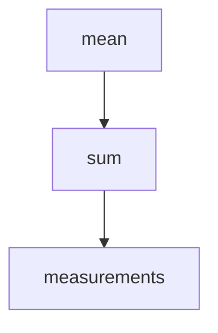

To create this structure it is necessary to create the corresponding configuration objects. So **Mean** and **Sum** will be represented as **CalculataedDataConfig** objects and the **Measurements** will be represented as a **MeasurementConfig** object.

In the case of **CalculatedDataConfig** a **ViewData** must be associated. This  association is what defines the number of data sources that the resulting calculated data document will contain.

### Configuration example 1

For example, lets say that the **Sum** level does not exist for a moment and the objective is just to create a calculated data document for each unique mean value.

To achieve this the following configurations may be created

```
measurement_conf = MeasurementConfig(
    name="measurement",
    value="m",
)

mean_conf = CalculatedDataConfig(
    name="sum mean",
    value="mean",
    view_data=MeanView().apply(elements),
    source_configs=(measurement_conf,),
)

configs = CalcDocsConfig(
    [
        mean_conf,
    ]
)

configs.construct()
```

The **MeanView** used in this example is the same one described before. This view splits the elements as follows.


Now, the inner code of a **CalculatedDataConfig** iterates over all posible keys in the view data and creates a calculated data document for each. The data sources of an specific calculated data document are created from the childs that the **ViewData** returns after being accessed with a **Keys** object.

In this example, the **MeanView** contains 4 unique values (5, 13, 21, 29), then 4 calculated documents will be constructed. The data sources of each calculated data document are the childs of those entries in the **ViewData** structure. For instance, in the case of **Mean = 5** there are 4 child elements (1, 2, 3, 4), those will be used as data sources of the respective calculated data document. The result would look like this

```
[
    CalculatedDocument(
         name='sum mean',
         value=5.0,
         data_sources=[
             DataSource(feature='measurement', reference=Element(uuid='uuid1'), value=1.0),
             DataSource(feature='measurement', reference=Element(uuid='uuid2'), value=2.0),
             DataSource(feature='measurement', reference=Element(uuid='uuid3'), value=3.0),
             DataSource(feature='measurement', reference=Element(uuid='uuid4'), value=4.0),
         ],
    ),
    CalculatedDocument(
         name='sum mean',
         value=13.0,
         data_sources=[
             DataSource(feature='measurement', reference=Element(uuid='uuid5'), value=5.0),
             DataSource(feature='measurement', reference=Element(uuid='uuid6'), value=6.0),
             DataSource(feature='measurement', reference=Element(uuid='uuid7'), value=7.0),
             DataSource(feature='measurement', reference=Element(uuid='uuid8'), value=8.0),
         ],
    ),
    CalculatedDocument(
         name='sum mean',
         value=21.0,
         data_sources=[
             DataSource(feature='measurement', reference=Element(uuid='uuid9'), value=9.0),
             DataSource(feature='measurement', reference=Element(uuid='uuid10'), value=10.0),
             DataSource(feature='measurement', reference=Element(uuid='uuid11'), value=11.0),
             DataSource(feature='measurement', reference=Element(uuid='uuid12'), value=12.0),
         ],
    ),
    CalculatedDocument(
         name='sum mean',
         value=29.0,
         data_sources=[
             DataSource(feature='measurement', reference=Element(uuid='uuid13'), value=13.0),
             DataSource(feature='measurement', reference=Element(uuid='uuid14'), value=14.0),
             DataSource(feature='measurement', reference=Element(uuid='uuid15'), value=15.0),
             DataSource(feature='measurement', reference=Element(uuid='uuid16'), value=16.0),
         ],
    ),
]
```

Or in a graph representation

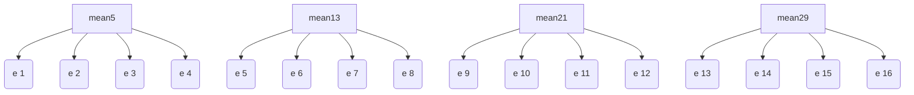

### Configuration example 2

Now, for the construction of all the example calculated data documents,  the following configurations may be used

```
measurement_conf = MeasurementConfig(
    name="measurement",
    value="m",
)

sum_conf = CalculatedDataConfig(
    name="sumation",
    value="sum",
    view_data=MeanView(sub_view=SumView()).apply(elements),
    source_configs=(measurement_conf,),
)

mean_conf = CalculatedDataConfig(
    name="sum mean",
    value="mean",
    view_data=MeanView().apply(elements),
    source_configs=(sum_conf,),
)

configs = CalcDocsConfig(
    [
        sum_conf,
        mean_conf,
    ]
)
```

The **View** used in the mean **CalculatedDataConfig** is the same from the previous example but the one from the sum **CalculatedDataConfig** is a nested version of **MeanView** and **SumView**.

This last detail is very important.

The objective calculated data document structure states that a **mean** calculated data document have specific **sum** childs.

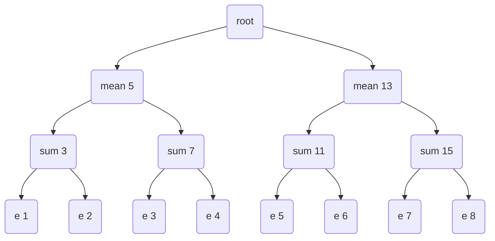

**mean 5** is only parent of  **sum 3** and **sum 7**, while  **mean 13** is only parent of **sum 11** and **sum 15**.

If the view used in the sum **CalculatedDataConfig** is just **SumView**, then there is no relation in the **ViewData** keys from the **mean** configuration and the ones from **sum**.

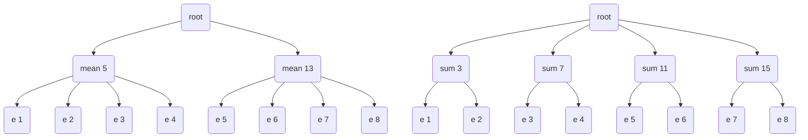

This means that when the data sources of a specific **mean** calculated data documents are going to be constructed there is no way to associate which **sum** keys should be used, resulting in all of them being used. The result would be the following wrong structure

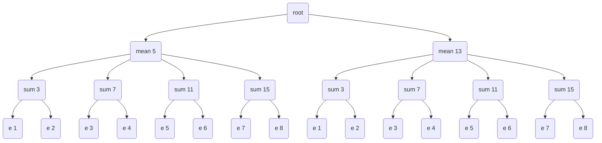

If instead the nested **View** is used in the **sum** configuration

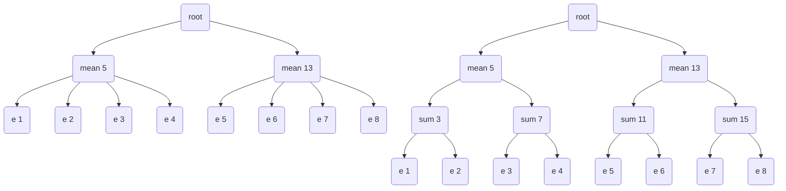

The keys from the **MeanView** can be found in the structure of the sum nested **ViewData**, resulting in a filtering of a specific **mean** node that contains only the specific **sum** entries expected to be used as data sources. The result would be


Which is exactly what is expected.

### Real configuration example


In this diagram Calc doc represents a **CalculatedDataConfig** object, Meas represents a **MeasurementConfig** object and the cylinders represent the views.

## Execution example

An execution example is shown in the following diagram. Each box corresponds to an invocation, the arrows indicate the next step, the dotted line represents the specification of a computation and the elements outside the box correspond to descriptions or clarifications.

The configuration code is the following

```
measurement_conf = MeasurementConfig(
    name="measurement",
    value="m",
)

sum_conf = CalculatedDataConfig(
    name="sumation",
    value="sum",
    view_data=MeanView(sub_view=SumView()).apply(elements),
    source_configs=(measurement_conf,),
)

mean_conf = CalculatedDataConfig(
    name="sum mean",
    value="mean",
    view_data=MeanView().apply(elements),
    source_configs=(sum_conf,),
)

configs = CalcDocsConfig(
    [
        sum_conf,
        mean_conf,
    ]
)
```

### Sum calculated data construction


### Mean calculated data construction


