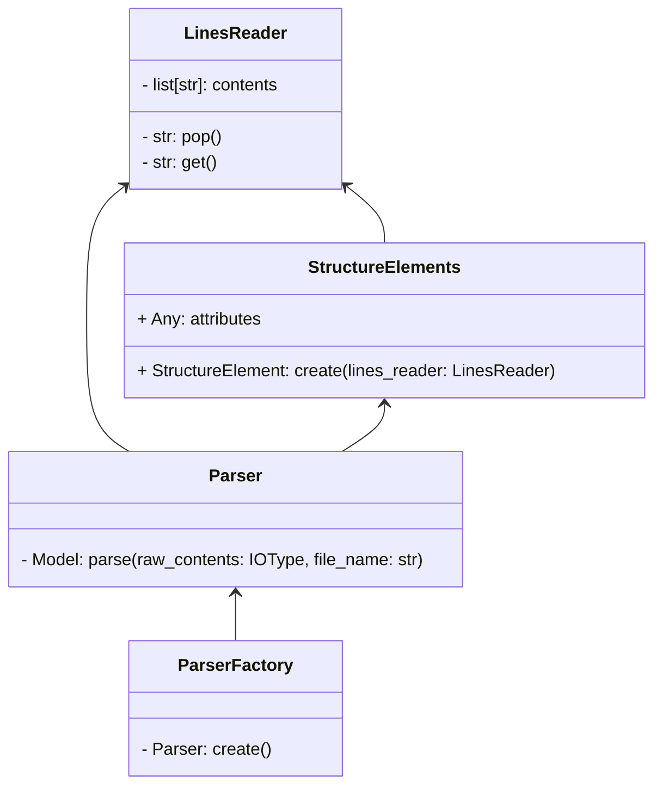
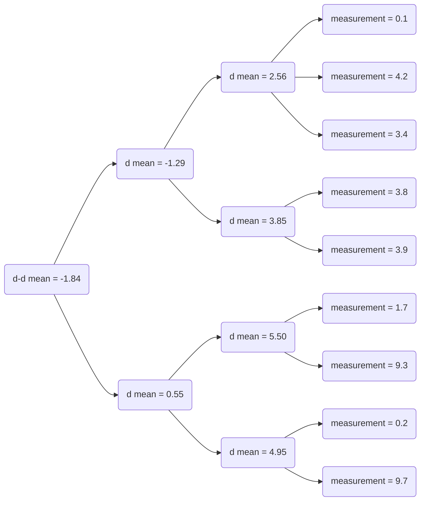

# allotropy parser structure


The allotropy library has a collection of data parsers, each of which follows a general structure.
The idea of this structure is to ease the understanding of any parser in the library by defining the
same basic building blocks.

## General structure



- **LinesReader**: Default class to read raw data file, a specific implementation may use or
implement an alternative reader for its use case.
- **Structure Elements**: Representation of the specific data structure of the files read by each parser.
- **Parser**: Entry point and main controller of the parser.
- **ParserFactory**: Default constructor for any parser in the library.

## Behavior

The first step of the process is to use the **ParserFactory** to instantiate the desired **Parser**.
This **Parser** receives an IO stream containing the raw information of the input file, in most cases
the parsers can use a **LinesReader** instance to perform the decoding and allow an easy reading
of every part of the file.

The **Parser** then invokes the **create** method of the structure elements to actually construct
the python representation of the input file (**Structure Elements**). This structure is a set
of composed **dataclass** definitions that contains all the elements needed to build the actual
output json schema. The **create** method of this **Structure Elements** usually receive an
instance of a **LinesReader** to ease the extraction of the information that they need. Finally the
 **Parser** builds the json schema using the information encoded in the **Structure Elements**.


# Calculated documents

The intent of the calculated documents is to give information about which parts of a document are used
to calculate other parts.

## Example

Supose the following data is provided

| Group      | measurement | mean    | d mean | d-d mean
|  --------  |  -------    | ------- | -------| -------
| A          | 0.1         | 2.56    | -1.29  | -1.84
| A          | 4.2         | 2.56    | -1.29  | -1.84
| C          | 1.7         | 5.50    | 0.55   | x
| A          | 3.4         | 2.56    | -1.29  | -1.84
| C          | 9.3         | 5.50    | 0.55   | x
| B          | 3.8         | 3.85    | x      | x
| B          | 3.9         | 3.85    | x      | x
| D          | 0.2         | 4.95    | x      | x
| D          | 9.7         | 4.95    | x      | x

* Group column represents the category to which each sample belongs (A, B, C, D).
* Measurement column is the value that corresponds to each sample
* Mean represents the mean value for each of the groups (group A is 2.56, B is 3.85, C is 5.5, D is 4.95)
* D mean is the difference between the **mean** of groups A and B (2.56 - 3.85) and groups C and D (5.5 - 4.95)
* D-D mean is the difference between the **d mean** of groups A and C (-1.29 - 0.55)

For this case the calculated document structure that should be created is


## Implementation

The definition of a **calculated document** is as follows

```
@dataclass
class Referenceable:
    uuid: str
```

```
@dataclass
class CalculatedDocument(Referenceable):
    uuid: str
    name: str
    value: float
    data_sources: list[DataSource]
    iterated: bool = False
```

```
@dataclass
class DataSource:
    feature: str
    reference: Union[CalculatedDocument, Referenceable]
```

The idea of the implementation is to allow the construction of a graph in which each node is a **Referenceable** object.
In other words, each node is identifiable by an uuid.

**Iterated attribute**
It is important to explain that a node can be referenced more than one time.
For example a measurement can be referenced by a mean calculation but also by a standard deviation.
This means that a node could be visited more than once when walking through the graph.

To allow an easy implementation of calculated document graph to ASM structure the iterated attribute was introduced.
This boolean value is initialized with a **False** value and then is turn into **True** when a node is visited for the first time.
By doing this any possible duplicates are avoided.
