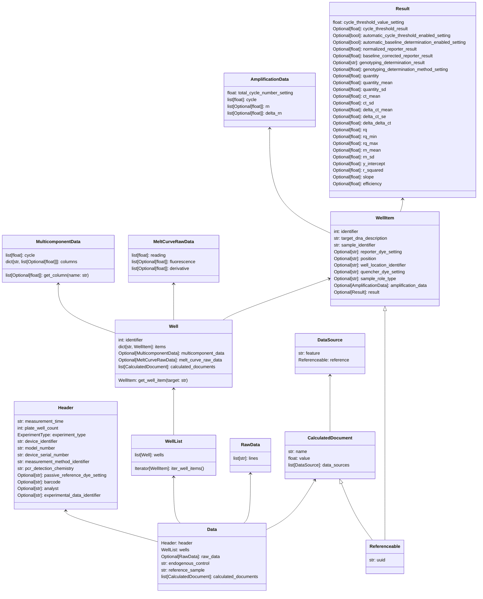

# Appbio Quantstudio parser structure

```mermaid
classDiagram
    class Data {
        Header: header
        WellList: wells
        Optional[RawData]: raw_data
        str: endogenous_control
        str: reference_sample
        list[CalculatedDocument]: calculated_documents
    }
    class Header {
        str: measurement_time
        int: plate_well_count
        ExperimentType: experiment_type
        str: device_identifier
        str: model_number
        str: device_serial_number
        str: measurement_method_identifier
        str: pcr_detection_chemistry
        Optional[str]: passive_reference_dye_setting
        Optional[str]: barcode
        Optional[str]: analyst
        Optional[str]: experimental_data_identifier
    }
    class WellList {
        list[Well]: wells
        Iterator[WellItem]: iter_well_items()
    }
    class Well {
        int: identifier
        dict[str, WellItem]: items
        Optional[MulticomponentData]: multicomponent_data
        Optional[MeltCurveRawData]: melt_curve_raw_data
        list[CalculatedDocument]: calculated_documents
        WellItem: get_well_item(target: str)
    }
    class MulticomponentData {
        list[float]: cycle
        dict[str, list[Optional[float]]]: columns
        list[Optional[float]]: get_column(name: str)
    }
    class MeltCurveRawData {
        list[float]: reading
        list[Optional[float]]: fluorescence
        list[Optional[float]]: derivative
    }
    class WellItem {
        int: identifier
        str: target_dna_description
        str: sample_identifier
        Optional[str]: reporter_dye_setting
        Optional[str]: position
        Optional[str]: well_location_identifier
        Optional[str]: quencher_dye_setting
        Optional[str]: sample_role_type
        Optional[AmplificationData]: amplification_data
        Optional[Result]: result
    }
    class AmplificationData {
        float: total_cycle_number_setting
        list[float]: cycle
        list[Optional[float]]: rn
        list[Optional[float]]: delta_rn
    }
    class Result {
        float: cycle_threshold_value_setting
        Optional[float]: cycle_threshold_result
        Optional[bool]: automatic_cycle_threshold_enabled_setting
        Optional[bool]: automatic_baseline_determination_enabled_setting
        Optional[float]: normalized_reporter_result
        Optional[float]: baseline_corrected_reporter_result
        Optional[str]: genotyping_determination_result
        Optional[float]: genotyping_determination_method_setting
        Optional[float]: quantity
        Optional[float]: quantity_mean
        Optional[float]: quantity_sd
        Optional[float]: ct_mean
        Optional[float]: ct_sd
        Optional[float]: delta_ct_mean
        Optional[float]: delta_ct_se
        Optional[float]: delta_delta_ct
        Optional[float]: rq
        Optional[float]: rq_min
        Optional[float]: rq_max
        Optional[float]: rn_mean
        Optional[float]: rn_sd
        Optional[float]: y_intercept
        Optional[float]: r_squared
        Optional[float]: slope
        Optional[float]: efficiency
    }
    class RawData {
        list[str]: lines
    }
    class CalculatedDocument {
        str: name
        float: value
        list[DataSource]: data_sources
    }
    class DataSource {
        str: feature
        Referenceable: reference
    }
    class Referenceable {
        str: uuid
    }
    Header <-- Data
    WellList <-- Data
    Well <-- WellList
    MulticomponentData <-- Well
    MeltCurveRawData <-- Well
    WellItem <-- Well
    AmplificationData <-- WellItem
    Result <-- WellItem
    RawData <-- Data
    CalculatedDocument <-- Data
    DataSource <-- CalculatedDocument
    CalculatedDocument <|-- Referenceable
    WellItem <|-- Referenceable
```
