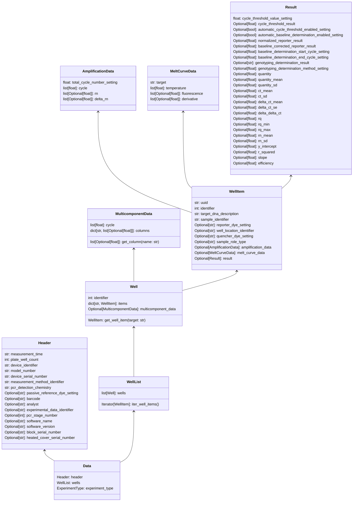

# Appbio Quantstudio design and analysis parser structure
  

```mermaid
classDiagram
	class Data {
	    Header: header 
	    WellList: wells
	    ExperimentType: experiment_type
    }
    class Header {
	    str: measurement_time
	    int: plate_well_count
	    str: device_identifier
	    str: model_number
	    str: device_serial_number
	    str: measurement_method_identifier
	    str: pcr_detection_chemistry
	    Optional[str]: passive_reference_dye_setting
	    Optional[str]: barcode
	    Optional[str]: analyst
	    Optional[str]: experimental_data_identifier
	    Optional[int]: pcr_stage_number
	    Optional[str]: software_name
	    Optional[str]: software_version
	    Optional[str]: block_serial_number
	    Optional[str]: heated_cover_serial_number
    }
    class WellList {
	    list[Well]: wells
	    Iterator[WellItem]: iter_well_items()
    }
    class Well {
	    int: identifier
	    dict[str, WellItem]: items 
	    Optional[MulticomponentData]: multicomponent_data
	    WellItem: get_well_item(target: str)
	}
	class MulticomponentData {
	    list[float]: cycle 
	    dict[str, list[Optional[float]]]: columns 
	    list[Optional[float]]: get_column(name: str)
    }
	class WellItem {
	    str: uuid
	    int: identifier
	    str: target_dna_description
	    str: sample_identifier
	    Optional[str]: reporter_dye_setting
	    Optional[str]: well_location_identifier
	    Optional[str]: quencher_dye_setting
	    Optional[str]: sample_role_type
	    Optional[AmplificationData]: amplification_data
	    Optional[MeltCurveData]: melt_curve_data
	    Optional[Result]: result
	}
	class MeltCurveData {
	    str: target
	    list[float]: temperature
	    list[Optional[float]]: fluorescence
	    list[Optional[float]]: derivative
    }
	class AmplificationData {
	    float: total_cycle_number_setting
	    list[float]: cycle
	    list[Optional[float]]: rn
	    list[Optional[float]]: delta_rn
    }
    class Result {
	    float: cycle_threshold_value_setting
	    Optional[float]: cycle_threshold_result
	    Optional[bool]: automatic_cycle_threshold_enabled_setting
	    Optional[bool]: automatic_baseline_determination_enabled_setting
	    Optional[float]: normalized_reporter_result
	    Optional[float]: baseline_corrected_reporter_result
	    Optional[float]: baseline_determination_start_cycle_setting
	    Optional[float]: baseline_determination_end_cycle_setting
	    Optional[str]: genotyping_determination_result 
	    Optional[float]: genotyping_determination_method_setting
	    Optional[float]: quantity
	    Optional[float]: quantity_mean
	    Optional[float]: quantity_sd
	    Optional[float]: ct_mean
	    Optional[float]: ct_sd
	    Optional[float]: delta_ct_mean
	    Optional[float]: delta_ct_se
	    Optional[float]: delta_delta_ct
	    Optional[float]: rq
	    Optional[float]: rq_min
	    Optional[float]: rq_max
	    Optional[float]: rn_mean
	    Optional[float]: rn_sd
	    Optional[float]: y_intercept
	    Optional[float]: r_squared
	    Optional[float]: slope
	    Optional[float]: efficiency
    }
    Header <-- Data
    WellList <-- Data
    Well <-- WellList
    MulticomponentData <-- Well
    WellItem <-- Well
    AmplificationData <-- WellItem
    MeltCurveData <-- WellItem
    Result <-- WellItem
```
